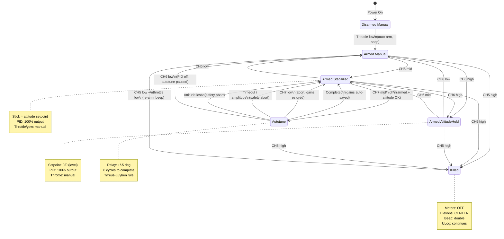
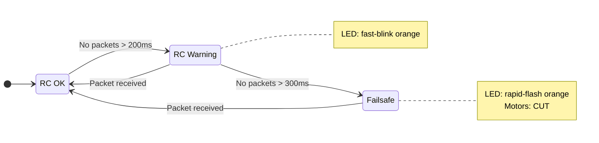
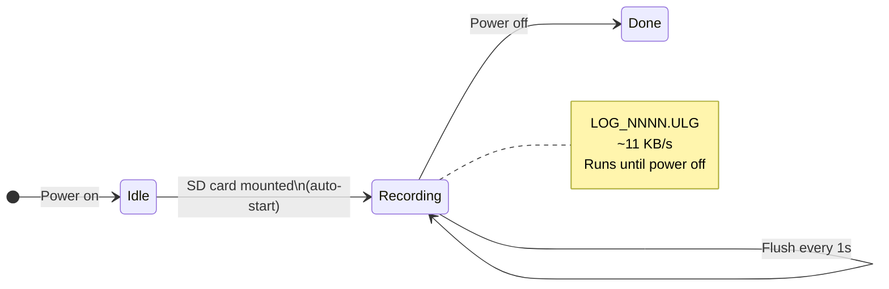

# State Diagrams

## Pilot State Machine

### ASCII

```
                         POWER ON
                            │
                            ▼
                   ┌────────────────┐
                   │    DISARMED    │
                   │    Manual      │
                   │  (LED: solid   │
                   │    green)      │
                   └───────┬────────┘
                           │ throttle low (auto-arm)
                           │ beep: single
                           ▼
              ┌────────────────────────────┐
    ┌────────►│       ARMED MANUAL         │◄───────────────┐
    │         │  (LED: double-blink green)  │                │
    │         └─────┬──────────────┬───────┘                │
    │               │              │                         │
    │         CH6 mid│        CH6 high                       │
    │               │              │                         │
    │               ▼              ▼                         │
    │    ┌──────────────┐  ┌───────────────┐                │
    │    │    ARMED     │  │    ARMED      │                │
    │    │ STABILIZED   │  │ ALTITUDE HOLD │                │
    │    │ (LED: pulse  │  │ (LED: pulse   │                │
    │    │   cyan)      │  │   cyan)       │                │
    │    └──┬───┬───────┘  └───────┬───────┘                │
    │       │   │                  │                         │
    │ CH6 low   │ CH7 mid/high    │ CH6 low                 │
    │       │   │                  │                         │
    ├───────┘   ▼                  └─────────────────────────┘
    │    ┌──────────────┐
    │    │   AUTOTUNE   │
    │    │   (relay)    │
    │    │              │
    │    │ setpoint:    │
    │    │  ±5° square  │
    │    │  wave        │
    │    └──┬───┬───┬───┘
    │       │   │   │
    │  CH7 low  │   │ timeout / amplitude > 20°
    │  (abort)  │   │ attitude data lost
    │       │   │   │
    │       │   │   ▼
    │       │   │  STABILIZED (gains restored)
    │       │   │
    │       │   │ completed (6 cycles)
    │       │   ▼
    │       │  STABILIZED (new gains auto-saved)
    │       │
    │       ▼
    │      STABILIZED (gains restored)
    │
    │
    │   ──── CH5 HIGH (from ANY armed state) ────
    │                    │
    │                    ▼
    │         ┌──────────────────┐
    │         │      KILLED      │
    │         │                  │
    │         │ motors: OFF      │
    │         │ elevons: CENTER  │
    │         │ beep: double     │
    │         │ ULog: continues  │
    │         └────────┬─────────┘
    │                  │ CH5 low + throttle low
    │                  │ beep: single (re-arm)
    └──────────────────┘


  RC LINK LOST (from any armed state):
  ┌──────────┐    200ms    ┌──────────┐    300ms    ┌──────────┐
  │  RC OK   │───────────►│ WARNING  │───────────►│ FAILSAFE │
  │          │             │ (LED:    │             │ (LED:    │
  │          │◄────────────│ fast-blink│            │ rapid-   │
  │          │  RC returns │ orange)  │             │ flash    │
  └──────────┘             └──────────┘             │ orange)  │
                                                    │          │
                                                    │ motors   │
                                                    │ cut      │
                                                    └──────────┘

  ULog LIFECYCLE (independent of flight state):
  ┌──────────┐  SD mounted  ┌───────────┐          ┌──────────┐
  │  IDLE    │─────────────►│ RECORDING │─────────►│  DONE    │
  │          │  auto-start  │ LOG_N.ULG │  power   │          │
  └──────────┘              │ flush 1Hz │  off     └──────────┘
                            └───────────┘
```

### Mermaid






