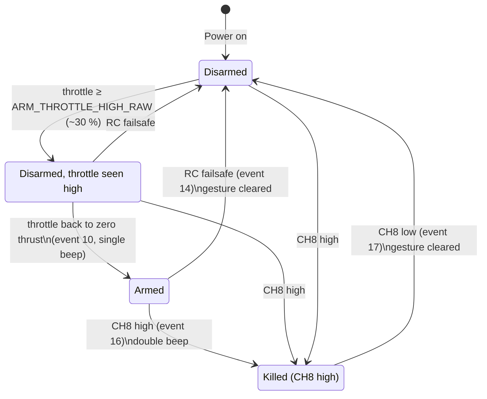
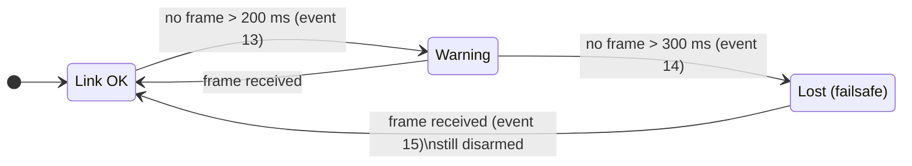
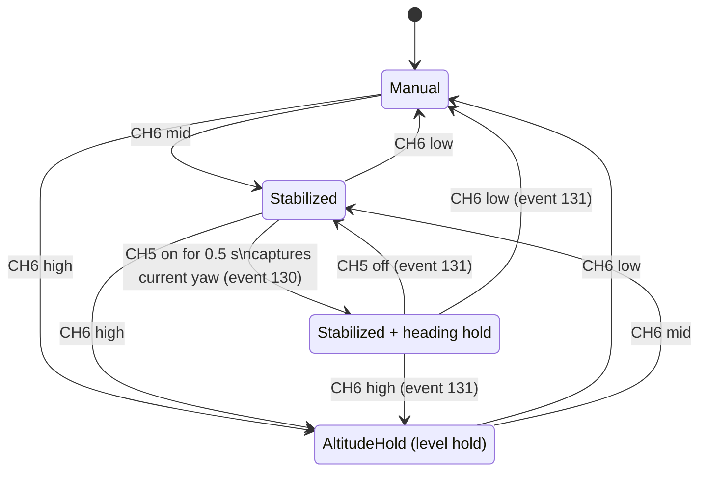
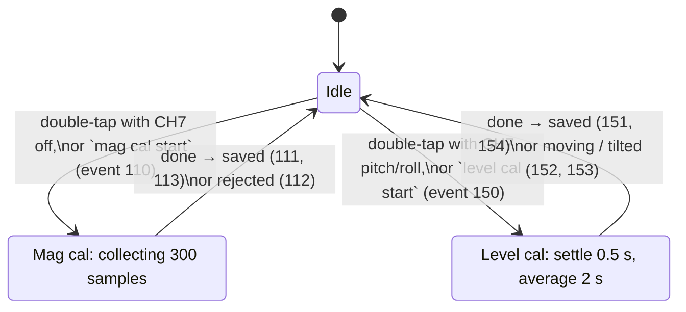
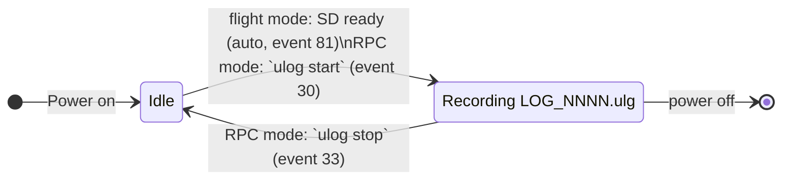

# State Diagrams

The state machines behind [`docs/OPERATIONS.md`](docs/OPERATIONS.md). Arming, flight
mode, autotune, link state and ULog are **independent** machines: arming does not depend
on the mode switch, and the mode can change while disarmed.

Code: arming `crates/elle-control/src/arming.rs`; link state
`FlightController::check_failsafe` (`crates/elle-system/src/system.rs`); mode, heading
hold, autotune and ULog in `crates/elle-app/src/flight.rs` (flight mode) and `rpc.rs`
(RPC mode).

## Arming (flight mode and `rpc-rc`)

- Booting with the stick low does not arm: the "high" half must be seen first.
- While killed, every tick disarms, centres the elevons, sends zero to the engines and
  skips the controller.
- The gesture cannot progress while the failsafe is active.
- Pure RPC mode has no gesture: `arm` / `disarm` / `stop` over RPC, and `arm` is refused
  while the commanded throttle is above zero (event 18).

## Link state and failsafe

- **Lost:** disarm, zero thrust, PID reset, elevons centred, LED rapid-flash orange.
  Warning while armed: LED fast-blink orange.
- The link is the CRSF receiver in flight mode and with `rpc-rc`. In pure RPC mode it is
  the **host**: age since the last RPC frame (`HOST_LAST_RX_MS`); losing it also zeroes the
  commanded throttle and surfaces so they don't return on reconnect.

## Flight mode and heading hold

- The mode follows CH6 armed or not. In RPC mode it comes from `mode` commands and
  heading hold from `SetHeadingHold` (explicit target, event 132).
- Manual: PID off. Stabilized: sticks set attitude (±25° pitch, ±45° roll). AltitudeHold:
  0°/0° setpoint, throttle manual.
- Heading hold replaces the roll stick with a heading controller (bank ≤ 25°).

## Autotune

```mermaid
stateDiagram-v2
    state "Idle" as I
    state "Relay test" as R
    state "Gains applied, save pending" as P

    [*] --> I
    I --> R: CH7 off → pitch/roll\n(armed, Stabilized or AltitudeHold;\npitch locked after a pitch success)
    R --> I: CH7 off (event 92)\ngains restored
    R --> I: timeout / amplitude > 20° /\nattitude lost (event 93)\ngains restored
    R --> I: result fails validation (event 94)\ngains restored, nothing saved
    R --> P: complete (event 91)\nnew gains active
    P --> I: next disarm → flash save (event 100)\n(dart: never saved)
```

- RPC mode uses `autotune pitch|roll|abort` instead of CH7; there is no pitch lock.
- The relay swings the setpoint ±5° (default) and needs 2 discarded + 6 measured cycles.
- Kill switch and failsafe disarm but **do not abort** the autotuner; switching to
  Manual turns the PID off without aborting it either. Abort with CH7 or `autotune abort`.
- Flash is never written while armed, hence the pending state.

## Calibrations

The double-tap needs: kill switch on, disarmed, throttle low, gyro quiet. Both are
refused while armed and only complete while disarmed.

## ULog

Flight mode records until power-off. Each boot writes a new file; existing files are
never overwritten.

## LED

The full table is in [`docs/OPERATIONS.md`](docs/OPERATIONS.md#led). The disarmed colour
tells you whether the gyro bias was measured at boot: solid green (RPC: solid purple)
when it was, pulsing when not.
