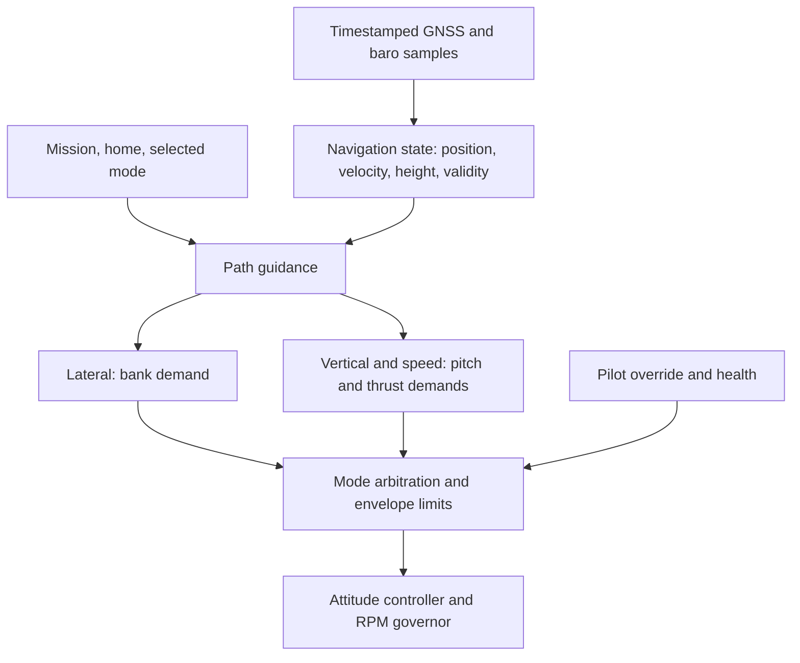

# Navigation Plan

Waypoint following, loiter and return-to-home after a pilot-controlled launch.
Automatic takeoff and landing come later, as separate capabilities.

## Principles

- **Navigation produces demands, never actuator commands.** It asks for a bank angle
  (and later a pitch and a thrust); the existing attitude controller and RPM governor
  fly them. Both airframes run the same code with their own measured limits.
- **Every measurement carries its time and its validity.** A cached number is not a
  measurement: fixes age out, a GGA fix has no velocity, a demand has a deadline.
- **Hardware-independent.** `crates/elle-nav` takes timestamped samples and returns
  demands, so logs can be replayed and failures simulated on the host.
- **Safety before engagement.** Mode arbitration, pilot override, RC/GNSS loss and
  fences are built before navigation is ever allowed to move a surface, not after
  waypoint following works.

## Current state

- Inner attitude PID at 200 Hz; AHRS heading (Madgwick 9-DOF); heading hold (CH5,
  Stabilized: heading error → roll setpoint, `elle-control/src/heading.rs`).
- GNSS: SAM-M10Q, UBX-NAV-PVT at 5 Hz: position, NED velocity, accuracy estimates.
  Position kept as degrees × 10⁷; every solution stamped with its receive time
  (`GnssData::sample_us`). On the NMEA GGA fallback the velocity and accuracy fields
  are NaN, so a stale NAV-PVT velocity can never pass as current.
- Baro altitude and vario at ~20 Hz, stamped (`BaroReading::sample_us`).
- AltitudeHold is a level (0°/0°) hold; there is no altitude loop yet.
- No airspeed sensor.
- **`elle-nav` runs in observation mode** (below): state, home and a lateral demand
  are computed and logged; nothing reaches the controller.

## Step 1 (done): observation mode

`crates/elle-nav`, host-tested in `crates/elle-nav/tests/`:

| Module | What it does |
|---|---|
| `geo` | `GeoPoint` (degrees × 10⁷), `HomeNed` (a [sguaba](https://github.com/helsing-ai/sguaba) NED frame at home), `LocalFrame` (WGS84 → ECEF → home NED through sguaba, `f64`), `Ne` (`f32` north/east vectors for the guidance maths) |
| `estimate` | `Estimator`: quality gates (`NAV_MAX_H_ACC_M`, `NAV_MAX_S_ACC_MS`), home capture, fix timeout (`NAV_FIX_TIMEOUT_MS`), extrapolation along ground velocity (≤ `NAV_EXTRAPOLATE_MAX_MS`), baro height above home |
| `l1` | L1 guidance (after ArduPilot `AP_L1_Control`) for lines and loiter circles → lateral acceleration → bank demand, limited to `NAV_MAX_BANK_DEG` |
| `lib` | `Navigator::update(now, path)` → state, guidance, `valid_until_us`, status bits |

sguaba sits at the frame boundary only: the home frame is typed, so a position in it
cannot be confused with one in another frame (the body FRD frame, for wind
estimation, later). Its conversion is `f64`, which the RP2350 does in software, so it
runs once per fix (5 Hz), never per tick. Guidance works in `f32`. sguaba's `serde`
feature does not build without `std`, so it is off.

Firmware (`elle-app/src/nav.rs`, both loops, `gnss` builds only): new GNSS and baro
samples go to the navigator every tick; every 8 ticks (25 Hz) it is asked for the
lateral demand on the **reference path**, a loiter around home
(`NAV_LOITER_RADIUS_M` = 80 m, clockwise), logged as ULog `nav` next to the measured
roll. `gnss_data` is now logged once per solution (5 Hz) with its receive time.

**Home**: while disarmed, home follows every fix with h_acc ≤ `NAV_HOME_MAX_H_ACC_M`
(5 m) and ≥ `NAV_HOME_MIN_SATS` (6) satellites, together with the baro altitude at that
moment. It locks on the arming edge and is released on disarm. Without such a fix
there is no home, and nothing is valid.

**Reading it**: `elle_log.py nav` (flight-logs skill). Circling the field clockwise at
about 80 m in Stabilized, the demand and the measured roll should agree in sign and
roughly in size; circling anticlockwise, they disagree. That checks the sign
conventions end to end before any demand is used (TEST_PLAN 6.9).

Cost: +18.6 kB flash, +0.5 kB RAM (eagle flight build). CPU time is inside the
`log` stage of `loop_stages`; not yet measured on the board.

## Next steps

Each step flies in observation first, then with the pilot able to take over at once.

| Step | Deliverable | Before it may fly |
|---|---|---|
| 2 | Validate observation logs: fix age, extrapolation, home, sign conventions | Sustained stable Stabilized flight on the current prop and gains |
| 3 | Safety and arbitration: nav mode on a switch, stick override, RC loss, GNSS loss (no position → wings level, pilot), max distance fence, demand deadline enforced | Step 2 |
| 4 | Lateral guidance engaged: loiter around home, bank only; pilot keeps pitch and throttle | Step 3; measured bank and roll-rate limits |
| 5 | Altitude: limited climb-rate controller on baro height above home → pitch demand, with pitch and rate limits and anti-windup; GNSS height blended for drift | Measured cruise trim and climb/sink capability |
| 6 | Line segments and waypoint sequencing (acceptance radius or bisector crossing), completion action | Step 4 |
| 7 | Mission upload over RPC, validated completely before it replaces the active one; TUI commands | Step 6 |
| 8 | Return-to-home: route to home, loiter there (landing is separate) | Steps 3–7 |
| 9 | Speed and energy: TECS or equivalent pitch/thrust coordination | Airspeed sensor, characterised aircraft |

## What the plan must not assume

- **GNSS loss cannot trigger a dead-reckoned return-to-home.** There is no inertial
  estimator; position is gone `NAV_FIX_TIMEOUT_MS` after the last fix. GNSS loss hands
  the aircraft back (wings level, pilot) instead.
- **Height above home is not height above terrain.** A minimum-altitude floor is
  relative to the take-off point only.
- **Ground speed is not airspeed.** A tailwind gives high ground speed with too
  little airflow; no stall protection can come from GNSS. A calibrated pitot sensor
  should come before autonomous altitude and speed control is expanded.
- **RPM is not speed.** The governor regulates propeller speed; navigation decides
  the thrust it needs.

## Reference

- ArduPlane navigation tuning (L1): <https://ardupilot.org/plane/docs/navigation-tuning.html>
- PX4 fixed-wing position tuning (inner loop first): <https://docs.px4.io/main/en/config_fw/position_tuning_guide_fixedwing>
- ArduPlane TECS: <https://ardupilot.org/plane/docs/tecs-total-energy-control-system-for-speed-height-tuning-guide.html>
- Park, Deyst, How, "A New Nonlinear Guidance Logic for Trajectory Tracking" (AIAA GNC 2004)
